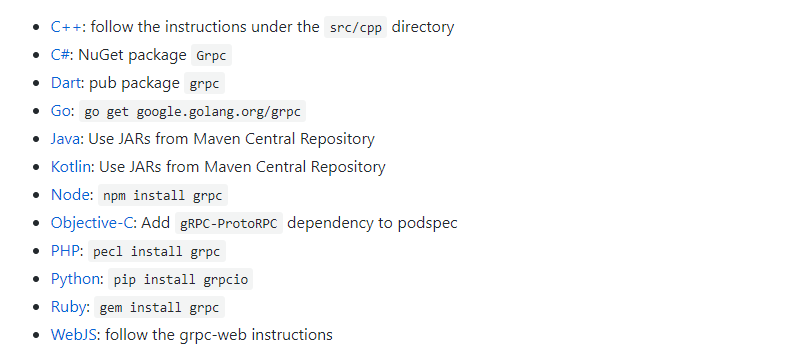
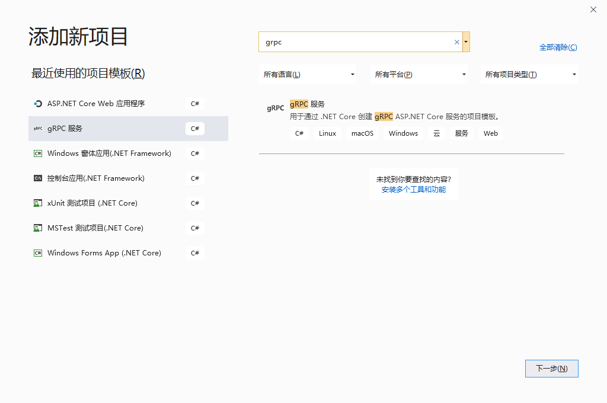

##### gRPC 简介

gRPC（gRPC Remote Procedure Calls）是一个由 Google 开源的，跨语言的，高性能的远程过程调用（RPC）框架。 gRPC 使客户端和服务端应用程序可以透明地进行通信，并简化了连接系统的构建。它使用 HTTP/2 作为通信协议，使用 Protocol Buffers 作为序列化协议。

官网：https://grpc.io/

Github：https://github.com/grpc/grpc

DotNet Core 官方示例：https://github.com/dotnet/AspNetCore.Docs/tree/master/aspnetcore/grpc

###### gRPC 的主要优点

* 现代高性能轻量级 RPC 框架。
* 约定优先的 API 开发，默认使用 Protocol Buffers 作为描述语言，允许与语言无关的实现。
* 可用于多种语言的工具，以生成强类型的服务器和客户端。
* 支持客户端，服务器双向流调用。
* 通过 Protocol Buffers 二进制序列化减少网络使用。
* 使用 HTTP/2 进行传输

###### gRPC 适用的场景

* 高性能的轻量级微服务。
* 多语言混合开发的 Polyglot 系统。
* 需要处理流式处理请求或响应的点对点实时通信服务。

###### gRPC 不适用的场景

* 浏览器可访问的 API：浏览器不完全支持 gRPC。虽然 gRPC-Web 可以提供浏览器支持，但是它有局限性，引入了服务器代理。
* 广播实时通信：gRPC 支持通过流进行实时通信，但不存在向已注册连接广播消息的概念。
* 进程间通信：进程必须承载 HTTP/2 才能接受传入的 gRPC 调用，对于 Windows，进程间通信管道是一种更快速的方法。

###### gRPC 支持的语言
目前 gRPC 已经实现了对主流的语言支持，以下语言在 gRPC 的 Github 中都提供了实现。


##### DotNet Core 使用 gRPC

###### 创建服务端
Visual Studio 2019 中已经集成了 gRPC 项目的模版，我们可以通过这个模版快速的创建一个基于 DotNet Core 的 gRPC 项目。


创建好的项目结构如下：

这时候项目不用做任何修改就可以运行了，那么这个项目和普通的 DotNet Core 项目有什么不同呢？
首先项目文件 `GrpcService.csproj` 中引入了 `Grpc.AspNetCore` 包。
```xml
  <ItemGroup>
    <PackageReference Include="Grpc.AspNetCore" Version="2.27.0" />
  </ItemGroup>
```
在 `appsettings.json` 文件中多出了一个 Kestrel 节点，配置 Protocols 使用 Http2 协议。
```json
"Kestrel": {
    "EndpointDefaults": {
      "Protocols": "Http2"
    }
  }
```
中
服务端 `GreeterService` 类的实现如下：
```csharp
    public class GreeterService : Greeter.GreeterBase
    {
        private readonly ILogger<GreeterService> _logger;
        public GreeterService(ILogger<GreeterService> logger)
        {
            _logger = logger;
        }

        public override Task<HelloReply> SayHello(HelloRequest request, ServerCallContext context)
        {
            return Task.FromResult(new HelloReply
            {
                Message = "Hello " + request.Name
            });
        }
    }
```
服务端 `Startup` 类中注入了 gRPC 服务：
```shell
    public void ConfigureServices(IServiceCollection services)
    {
        services.AddGrpc();
    }

    public void Configure(IApplicationBuilder app, IWebHostEnvironment env)
    {
        if (env.IsDevelopment())
        {
            app.UseDeveloperExceptionPage();
        }

        app.UseRouting();

        app.UseEndpoints(endpoints =>
        {
            endpoints.MapGrpcService<GreeterService>();

            endpoints.MapGet("/", async context =>
            {
                await context.Response.WriteAsync("Communication with gRPC endpoints must be made through a gRPC client. To learn how to create a client, visit: https://go.microsoft.com/fwlink/?linkid=2086909");
            });
        });
    }
```
gRPC 工具会根据 `proto` 文件自动生成需要使用的类，生成的类会存放在项目的 `obj\Debug\netcoreapp3.1` 目录下：


客户端项目需要手动的创建，创建方法也很简单，直接在解决方案中添加一个新的项目即可，这里我创建了一个空的 Web 项目。


项目创建好了以后首先要把 `proto` 文件添加到项目中，这里需要用到 `dotnet-grpc` 这个工具。
在命令行下安装 gRPC 工具：
```shell
dotnet tool install dotnet-grpc -g
```
安装完以后从命令行进入 GrpcClient 项目的目录后，添加服务端的 `proto` 文件到客户端。
```shell
 dotnet grpc add-file ..\GrpcService\Protos\greet.proto 
 ```
也可以使用远程路径的 `proto` 文件：
```shell
dotnet grpc add-url 
https://raw.githubusercontent.com/grpc/grpc/master/examples/protos/keyvaluestore.proto -o /Protos/keyvaluesrore.proto
```
导入 `proto` 文件以后，GrpcClient 项目文件中会增加如下代码：
```xml
  <ItemGroup>
    <Protobuf Include="..\GrpcService\Protos\greet.proto" 
Link="Protos\greet.proto" />
    <Protobuf Include="XXXX/Protos/keyvaluesrore.proto" 
Link="Protos\keyvaluesrore.proto">
<SourceUrl>https://raw.githubusercontent.com/grpc/grpc/master/examples/protos/keyvaluestore.proto</SourceUrl>
    </Protobuf>
  </ItemGroup>
```
接下来修改 `Startup` 中的代码，在 `ConfigureServices(IServiceCollection services)` 方法注入 gRPC 客户端代码：
```csharp
services.AddGrpcClient<GreeterClient>(options => options.Address = new 
Uri("https://localhost:5001"));
```
>注：`Uri("https://localhost:5001")` 中使用服务端的端口和地址。

在 `Configure` 方法中添加响应代码：
```csharp
    app.UseEndpoints(endpoints =>
    {
        endpoints.MapGet("/", async context =>
        {
            GreeterClient client = context.RequestServices.GetService<GreeterClient>();
            HelloRequest request = new HelloRequest();
            request.Name = "Charles";
            var reply = await client.SayHelloAsync(request);

            await context.Response.WriteAsync(reply.Message);
        });
    });
```
启动项目后在客户端可以看到输出了服务端返回的内容：
```shell
Hello Charles
```
