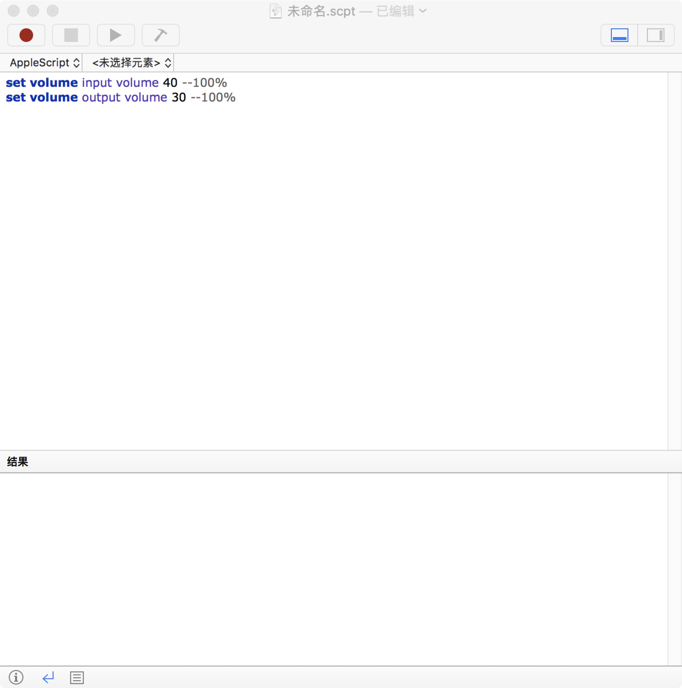

最近几年 Electron 很火，公司也正好有个项目想做跨平台客户端，大家研究了一下就选择了 Electron，第一次做 js 的项目遇到了不少坑，不过也都一点点解决了。

因为项目中需要对用户录音，HTML5 中的 API 又不支持调整麦克风音量，所以就对 Node js 操作 osx 系统麦克风、扬声器音量了解了一下，一开始在 [npm](https://www.npmjs.com/) 中找了很多包都是只能操作扬声器音量的，无法操作麦克风的音量，本来已经打算放弃了，缺无意间在网上看到 osx 系统下有自己的脚本——AppleScript，查看了官方文档之后发现 [AppleScript 确实可以控制系统的音量](https://developer.apple.com/library/archive/documentation/AppleScript/Conceptual/AppleScriptLangGuide/reference/ASLR_cmds.html#//apple_ref/doc/uid/TP40000983-CH216-SW41)，由于自己完全不懂 AppleScript，只能在 npm 寻找是否有现成的解决方案，终于在 npm 中搜索一番找到了 [osx-volume-controls](https://www.npmjs.com/package/osx-volume-controls) 这个包，经过改造终于实现了这个功能。

在 OS X 系统中测试一下设置扬声器和麦克风音量：
```shell
set volume output volume %s --100%
set volume input volume %s --100%
```


获取系统的音量信息：
```shell
input volume of (get volume settings) & output volume of (get volume settings) & output muted of (get volume settings)
```


osx-volume-controls 要依赖到 applescript 这个包，执行下面的命令安装到项目中：
```shell
 npm i -save applescript 
```
具体类实现代码如下：
```javascript
var applescript = require("applescript");

var scripts = {
  state: "input volume of (get volume settings) & output volume of (get volume settings) & output muted of (get volume settings)",
  volumeState: "output volume of (get volume settings)",
  inputState: "input volume of (get volume settings)",
  outputState: "output volume of (get volume settings)",
  muteState: "output muted of (get volume settings)",
  setOutput: "set volume output volume %s --100%",
  setInput: "set volume input volume %s --100%",
  increase: "set volume output volume (output volume of (get volume settings) + 10) --100%",
  decrease: "set volume output volume (output volume of (get volume settings) - 10) --100%",
  mute: "set volume with output muted",
  unmute: "set volume without output muted"
};

var exec = function (script, callback) {
  if (!callback) callback = function () {};
  applescript.execString(script, callback);
};

var getScript = function (scriptName, param) {
  var script = scripts[scriptName];
  if (typeof param !== "undefined") script = script.replace("%s", param);
  return script;
};

exports.state = function (callback) {
  return exec(getScript("state"), callback);
};

exports.volumeState = function (callback) {
  return exec(getScript("volumeState"), callback);
};

exports.inputState = function (callback) {
  return exec(getScript("inputState"), callback);
};

exports.outputState = function (callback) {
  return exec(getScript("outputState"), callback);
};

exports.muteState = function (callback) {
  return exec(getScript("muteState"), callback);
};

exports.setOutput = function (volume, callback) {
  return exec(getScript("setOutput", volume), callback);
};

exports.setInput = function (volume, callback) {
  return exec(getScript("setInput", volume), callback);
};

exports.increase = function (callback) {
  return exec(getScript("increase"), callback);
};

exports.decrease = function (callback) {
  return exec(getScript("decrease"), callback);
};

exports.mute = function (callback) {
  return exec(getScript("mute"), callback);
};

exports.unmute = function (callback) {
  return exec(getScript("unmute"), callback);
};

```

使用方法（可以参照 `osx-volume-controls` 的文档）：

```javascript
    import volume from "../../utils/osxVolume.js";
    volume.setInput(volumecontrol);
```