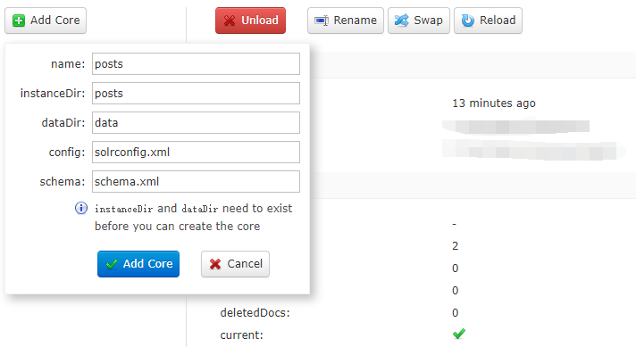
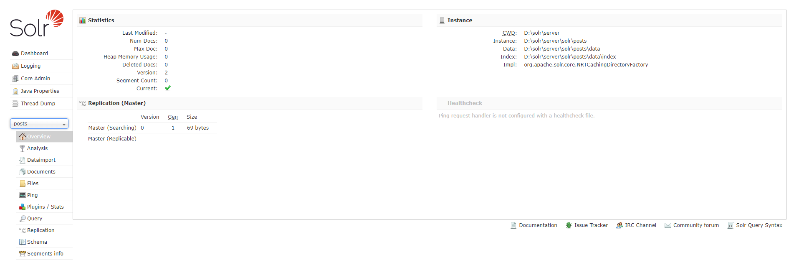
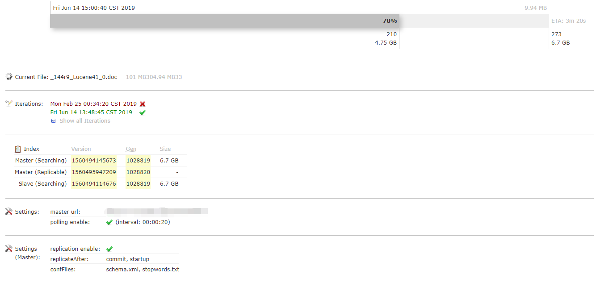
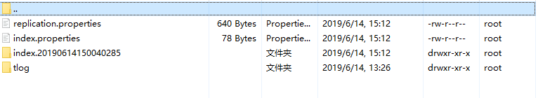

#### 前言

Solr 是一种可供企业使用的、基于 Lucene 的搜索服务器，它支持层面搜索、命中醒目显示和多种输出格式。在这篇文章中，将介绍 Solr 并展示如何轻松地将其表现优异的全文本搜索功能加入到 Web 应用程序中。

下载地址：https://lucene.apache.org/solr/downloads.html

本文中使用的Solr 版本：7.7.2，因为我是用的是 Windows 系统，所以主要介绍的是 Windows 下的部署方法。

#### 安装
Solr 内置了 Jetty，所以不需要任何安装任何 Web 容器即可运行。直接通过命令行就可以启动。

启动 Solr：
```shell
 .\solr.cmd start
```
停止 Solr：
```shell
 .\solr.cmd stop -all
```
#### 创建 Core
首先在 `server\solr` 文件夹中创建一个新的目录，然后将 `server\solr\configsets\_default` 下的 `conf` 目录复制到刚刚创建的文件夹。

在浏览器中打开 `http://localhost:8983/solr/` 点击左侧的 `Core Admin` 添加 Core。



`name` 和 `instanceDir` 都改成刚刚创建的目录名称。

创建好之后即可在左侧的 `Core Selector` 中找到这个 Core。

现在一个 Core 就创建好了，在 Core 的面板里可以对其进行一些基本操作。

Solr 的 Api 是支持通过调用接口添加数据的，但是在实际使用中我们都是从数据库中同步数据，所以我们需要为 Solr 配置数据源。



在 `solrconfig.xml` 文件中找到如下内容：
```xml
  <!-- Request Handlers
       http://wiki.apache.org/solr/SolrRequestHandler

       Incoming queries will be dispatched to a specific handler by name
       based on the path specified in the request.

       If a Request Handler is declared with startup="lazy", then it will
       not be initialized until the first request that uses it.
    -->
```
添加一个 `requestHandler` 节点：
```xml
  <requestHandler name="/dataimport" class="solr.DataImportHandler">
    <lst name="defaults">
      <str name="config">data-config.xml</str>
    </lst>
  </requestHandler>
```
data-config.xml 文件的大致结构如下：

稍后会对 data-config.xml 文件进行详细介绍。
#### 配置数据源

##### 使用 SQL Server 数据源
从[微软官网](
https://docs.microsoft.com/zh-cn/sql/connect/jdbc/download-microsoft-jdbc-driver-for-sql-server?view=sql-server-2017)下载 SQL Server 的 Microsoft SQL Server JDBC 驱动程序 4.1 驱动，复制到 `server\solr-webapp\webapp\WEB-INF\lib` 目录下。

这里需要注意的是把在下载的文件重命名为 `sqljdbc4.jar`，我之前没有改名死活加载不上。

使用 `com.microsoft.sqlserver.jdbc.SQLServerDriver` 驱动配置数据源：
```xml
<dataSource name="postData" driver="com.microsoft.sqlserver.jdbc.SQLServerDriver" url="jdbc:sqlserver://127.0.0.1:1433;SelectMethod=Cursor;DatabaseName=post;useLOBs=false;loginTimeout=60" user="charlestest" password="12345678" />
```
##### 使用 MySQL 数据源

下载：mysql-connector-java-6.0.6.jar 复制到 `server\solr-webapp\webapp\WEB-INF\lib` 目录下。

从 `dist` 目录复制 `solr-dataimporthandler-7.7.2.jar` 到 `server/solr-webapp/webapp/WEB-INF/lib` 中。
配置 `data-config.xml`：
```xml
<dataConfig>
    <dataSource name="postsData"  type="JdbcDataSource" driver="com.mysql.jdbc.Driver" url="jdbc:mysql://localhost:3306/posts?useUnicode=true&amp;useJDBCCompliantTimezoneShift=true&amp;useLegacyDatetimeCode=false&amp;serverTimezone=UTC" user="root" password="12345678" batchSize="-1" />
    <document name="posts">
        <entity name="Post" dataSource="postData" pk="Id" transformer="DateFormatTransformer,HTMLStripTransformer" rootEntity="true" query="SELECT Id, post_author, post_date, post_date_gmt, post_content, post_title, post_excerpt, post_status, comment_status, ping_status, post_password, post_name, to_ping, pinged, post_modified, post_modified_gmt, post_content_filtered, post_parent, guid, menu_order, post_type, post_mime_type, comment_count
        FROM wp_posts"
        deltaQuery="SELECT Id, post_author, post_date, post_date_gmt, post_content, post_title, post_excerpt, post_status, comment_status, ping_status, post_password, post_name, to_ping, pinged, post_modified, post_modified_gmt, post_content_filtered, post_parent, guid, menu_order, post_type, post_mime_type, comment_count
        FROM wp_posts post_modified &gt;'${dataimporter.last_index_time}' " 
        >
            <field column="Id" />
            <field column="post_author" />
            <field column="post_date" dateTimeFormat='yyyy-MM-dd HH:mm:ss'/>
            <field column="post_date_gmt" dateTimeFormat='yyyy-MM-dd HH:mm:ss'/>
            <field column="post_content" />
            <field column="post_title" />
            <field column="post_excerpt" />
            <field column="post_status" />
            <field column="comment_status" />
            <field column="ping_status" />
            <field column="post_password" />
            <field column="post_name" />
            <field column="to_ping" />
            <field column="pinged" />
            <field column="post_modified" dateTimeFormat='yyyy-MM-dd HH:mm:ss'/>
            <field column="post_modified_gmt" dateTimeFormat='yyyy-MM-dd HH:mm:ss'/>
            <field column="post_content_filtered" />
            <field column="post_parent" />
            <field column="guid" />
            <field column="menu_order" />
            <field column="post_type" />
            <field column="post_mime_type" />
            <field column="comment_count" />
            <entity name="PostAuthor" dataSource="authordata" pk="Id" query="SELECT Id, user_login, user_pass, user_nicename, user_email, user_url, user_registered, user_activation_key, user_status, display_name
            FROM wp_users where id=${Post.post_author}">
                <field column="Id" />
                <field column="user_login"/>
                <field column="user_pass"/>
                <field column="user_nicename"/>
                <field column="user_email"/>
                <field column="user_url"/>
                <field column="user_registered"/>
                <field column="user_activation_key"/>
                <field column="user_status"/>
                <field column="display_name"/>
            </entity>
        </entity>
    </document>
</dataConfig>
```
entity 中的一些常用属性：
* query：查询只对第一次全量导入有作用，对增量同步不起作用。
* deltaQuery：的意思是，查询出所有经过修改的记录的 Id 可能是修改操作，添加操作，删除操作产生的（此查询只对增量导入起作用，而且只能返回 Id 值）
* deletedPkQuery：此操作值查询那些数据库里伪删除的数据的 Id、solr 通过它来删除索引里面对应的数据（此查询只对增量导入起作用，而且只能返回 Id 值）。
* deltaImportQuery：是获取以上两步的 Id，然后把其全部数据获取，根据获取的数据对索引库进行更新操作，可能是删除，添加，修改（此查询只对增量导入起作用，可以返回多个字段的值，一般情况下，都是返回所有字段的列）。
* parentDeltaQuery：从本 entity 中的 deltaquery 中取得参数。

dataSource 中 batchSize 属性的作用是可以在批量导入的时候限制连接数量。

配置完成后重新加载一下 Core。

#### 中文分词

将 `contrib\analysis-extras\lucene-libs` 目录中的 `lucene-analyzers-smartcn-7.7.2.jar` 复制到 `server\solr-webapp\webapp\WEB-INF\lib` 目录下，否则会报错。
在 `managed-shchema` 中添加如下代码：
```xml
  <!-- 配置中文分词器 -->
  <fieldType name="text_cn" class="solr.TextField">
    <analyzer type="index">
      <tokenizer class="org.apache.lucene.analysis.cn.smart.HMMChineseTokenizerFactory" />
    </analyzer>
    <analyzer type="query">
      <tokenizer class="org.apache.lucene.analysis.cn.smart.HMMChineseTokenizerFactory" />
    </analyzer>
  </fieldType>
```
把需要使用中文分词的字段类型设置成 `text_cn`：
```xml
<field name="Remark" type="text_cn" indexed="true" stored="true" multiValued="false"/>
```

#### 主从部署
Solr 复制模式，是一种在分布式环境下用于同步主从服务器的一种实现方式，因之前提到的基于 rsync 的 SOLR 不同方式部署成本过高，被 Solr 1.4 版本所替换，取而代之的就是基于 HTTP 协议的索引文件传输机制，该方式部署简单，只需配置一个文件即可。Solr 索引同步的是 Core 对 Core，以 Core 为基本同步单元。

主服务器 `solrconfig.xml` 配置：
```xml
<requestHandler name="/replication" class="solr.ReplicationHandler">
    <lst name="master">
        <!-- 执行 commit 操作后进行 replicate 操作同样的设置'startup', 'commit', 'optimize'-->
        <str name="replicateAfter">commit</str>
        <!-- 执行 startup 操作后进行 replicate 操作 -->
        <str name="replicateAfter">startup</str>
        <!-- 复制索引时也同步以下配置文件 -->
        <str name="confFiles">schema.xml,stopwords.txt</str>
        <!-- 每次 commit 之后，保留增量索引的周期时间，这里设置为 5 分钟。 -->
        <str name="commitReserveDuration">00:05:00</str>  
        <!-- 验证信息，由用户自定义用户名-->
        <!-- <str name="httpBasicAuthUser">root</str> -->
        <!-- 验证信息，由用户自定义密码 -->
        <!-- <str name="httpBasicAuthPassword">password</str> -->
    </lst>
    <!--
       <lst name="slave">
         <str name="masterUrl">http://your-master-hostname:8983/solr</str>
         <str name="pollInterval">00:00:60</str>
       </lst>
    -->
</requestHandler>
```
从服务器 `solrconfig.xml` 配置：
```xml
<requestHandler name="/replication" class="solr.ReplicationHandler">
    <lst name="slave">
        <!-- 主服务器的同步地址 -->
        <str name="masterUrl">http://192.168.1.135/solr/posts</str>
        <!-- 从服务器同步间隔，即每隔多长时间同步一次主服务器 -->
        <str name="pollInterval">00:00:60</str>
        <!-- 压缩机制，来传输索引，可选 internal|external，internal：内网，external：外网 -->
        <str name="compression">internal</str>
        <!-- 设置连接超时（单位：毫秒） -->
        <str name="httpConnTimeout">50000</str>
        <!-- 如果设置同步索引文件过大，则应适当提高此值。（单位：毫秒） -->
        <str name="httpReadTimeout">500000</str>
        <!-- 验证用户名，需要和 master 服务器一致 -->
        <!-- <str name="httpBasicAuthUser">root</str> -->
        <!-- 验证密码，需要和 master 服务器一致 -->
        <!-- <str name="httpBasicAuthPassword">password</str> -->
    </lst>
</requestHandler>
```
Solr 主从同步是通过 Slave 周期性轮询来检查 Master 的版本，如果 Master 有新版本的索引文件，Slave 就开始同步复制。
* 1、Slave 发出一个 filelist 命令来收集文件列表。这个命令将返回一系列元数据（size、lastmodified、alias 等信息）。
* 2、Slave 查看它本地是否有这些文件，然后它会开始下载缺失的文件（使用命令 filecontent）。如果与 Master 连接失败，就会重新连接，如果重试 5 次还是没有成功，就会 Slave 停止同步。
* 3、文件被同步到了一个临时目录（`index.时间戳` 格式的文件夹名称，例如：index.20190614133600008）。旧的索引文件还存放在原来的文件夹中，同步过程中出错不会影响到 Slave，如果同步过程中有请求访问，Slave 会使用旧的索引。
* 4、当同步结束后，Slave 就会删除旧的索引文件使用最新的索引。

我们项目中 6.7G 的索引文件（279 万条记录），大概只用了 12 分钟左右就同步完成了，平均每秒的同步速度大约在 10M 左右。





**注意事项：** 如果主从的数据源配置的不一致，很可能导致从服务器无法同步索引数据。

#### 在项目中使用 Solr

##### 在 Java 项目中使用 Solr
SolrJ 是 Solr 的官方客户端，文档地址：[https://lucene.apache.org/solr/7_7_2/solr-solrj/](https://lucene.apache.org/solr/7_7_2/solr-solrj/)。
使用 maven 添加：
```xml
<!-- https://mvnrepository.com/artifact/org.apache.solr/solr-solrj -->
<dependency>
    <groupId>org.apache.solr</groupId>
    <artifactId>solr-solrj</artifactId>
    <version>7.7.2</version>
</dependency>
```
查询索引文档：
```java
    String keyword = "苹果";
    Map<String, String> queryParamMap = new HashMap<String, String>();
    queryParamMap.put("q", "*:*");
    queryParamMap.put("fq", keyword);
    MapSolrParams queryParams = new MapSolrParams(queryParamMap);
    QueryResponse queryResponse = client.query("posts", queryParams);
    SolrDocumentList results = queryResponse.getResults();
```
添加和更新索引文档：
```java
    // 通过 属性 添加到索引中
    SolrInputDocument doc = new SolrInputDocument();
    doc.addField("id", "10000");
    doc.addField("post_title", "test-title");
    doc.addField("post_name", "test-name");
    doc.addField("post_excerpt", "test-excerpt");
    doc.addField("post_content", "test-content");
    doc.addField("post_date", "2019-06-18 14:56:55");
    client.add("posts", doc);

    // 通过 Bean 添加到索引中
    Post post = new Post();
    post.setId(10001);
    post.setPost_title("test-title-10001");
    post.setPost_name("test-name");
    post.setPost_excerpt("test-excerpt");
    post.setPost_content("test-content");
    post.setPost_date(new Date());
    client.addBean("posts", post);

    client.commit("posts");
```
具体代码可以参考我 GitHub 中的示例，这里就不详细列出了。

##### 在  DotNet 项目中使用 Solr

SolrNet：https://github.com/mausch/SolrNet

通过 Nuget 添加 SolrNet：
```shell
Install-Package SolrNet
```
首先定义一个索引对象 `PostDoc`：
```csharp
    /// <summary>
    /// 文章 doc。
    /// </summary>
    [Serializable]
    public class PostDoc
    {
        [SolrUniqueKey("id")]
        public int Id { get; set; }

        [SolrField("post_title")]
        public string Title { get; set; }

        [SolrField("post_name")]
        public string Name { get; set; }

        [SolrField("post_excerpt")]
        public string Excerpt { get; set; }

        [SolrField("post_content")]
        public string Content { get; set; }

        [SolrField("post_date")]
        public DateTime PostDate { get; set; }
    }
```
在项目的 `Startup` 类中初始化 SolrNet：
```csharp
  SolrNet.Startup.Init<PostDoc>("http://localhost:8983/solr/posts");
```
添加或更新文档操作：
```csharp
    // 同步添加文档
    solr.Add(
        new PostDoc()
        {
            Id = 30001,
            Name = "This SolrNet Name",
            Title = "This SolrNet Title",
            Excerpt = "This SolrNet Excerpt",
            Content = "This SolrNet Content 30001",
            PostDate = DateTime.Now
        }
    );
    // 异步添加文档（更新）
    await solr.AddAsync(
        new PostDoc()
        {
            Id = 30001,
            Name = "This SolrNet Name",
            Title = "This SolrNet Title",
            Excerpt = "This SolrNet Excerpt",
            Content = "This SolrNet Content Updated 30001",
            PostDate = DateTime.Now
        }
    );
    // 提交
    ResponseHeader responseHeader = await solr.CommitAsync();
```
删除文档操作：
```csharp
    // 使用文档 Id 删除
    await solr.DeleteAsync("300001");
    // 直接删除文档
    await solr.DeleteAsync(new PostDoc()
    {
        Id = 30002,
        Name = "This SolrNet Name",
        Title = "This SolrNet Title",
        Excerpt = "This SolrNet Excerpt",
        Content = "This SolrNet Content 30002",
        PostDate = DateTime.Now
    });
    // 提交
    ResponseHeader responseHeader = await solr.CommitAsync();
```
搜索并对结果进行排序，在不传入分页参数的情况下 SolrNet 会返回所有满足条件的结果。
```csharp
    // 排序
	ICollection<SortOrder> sortOrders = new List<SortOrder>() {
	    new SortOrder("id", Order.DESC)
	};
	// 使用查询条件并排序
	SolrQueryResults<PostDoc> docs = await solr.QueryAsync("post_title:索尼", sortOrders);
```
使用字段筛选的另一种方式：
```csharp
    // 使用条件查询
    SolrQueryResults<PostDoc> posts = solr.Query(new SolrQueryByField("id", "30000"));
```
分页查询并对高亮关键字：
```csharp
    SolrQuery solrQuery = new SolrQuery("苹果");
	QueryOptions queryOptions = new QueryOptions
	{
	    // 高亮关键字
	    Highlight = new HighlightingParameters
	    {
	        Fields = new List<string> { "post_title" },
	        BeforeTerm = "<font color='red'><b>",
	        AfterTerm = "</b></font>"
	    },
	    // 分页
	    StartOrCursor = new StartOrCursor.Start(pageIndex * pageSize),
	    Rows = pageSize
	};
	SolrQueryResults<PostDoc> docs = await solr.QueryAsync(solrQuery, queryOptions);
	var highlights = docs.Highlights;
```
高亮关键字需要在返回结果中单独获取，`docs.Highlights` 是一个 `IDictionary<string, HighlightedSnippets>` 对象，每个 `key` 对应文档的 `id`，`HighlightedSnippets` 中也是一个 `Dictionary`，存储高亮处理后的字段和内容。

##### 在 Python 项目中使用 Solr

PySolr：https://github.com/django-haystack/pysolr
使用 `pip` 安装 pysolr：
```shell
pip install pysolr
```
简单的操作：
```python
# -*- coding: utf-8 -*-
import pysolr

SOLR_URL = 'http://localhost:8983/solr/posts'

def add():
    """
    添加
    """
    result = solr.add([
        {
            'id': '20000',
            'post_title': 'test-title-20000',
            'post_name': 'test-name-20000',
            'post_excerpt': 'test-excerpt-20000',
            'post_content': 'test-content-20000',
            'post_date': '2019-06-18 14:56:55',
        },
        {
            'id': '20001',
            'post_title': 'test-title-20001',
            'post_name': 'test-name-20001',
            'post_excerpt': 'test-excerpt-20001',
            'post_content': 'test-content-20001',
            'post_date': '2019-06-18 14:56:55',
        }
    ])
    solr.commit()
    results = solr.search(q='id: 20001')
    print(results.docs)

def delete():
    """
    删除
    """
    solr.delete(q='id: 20001')
    solr.commit()
    results = solr.search(q='id: 20001')
    print(results.docs)

def update():
    """
    更新
    """
    solr.add([
        {
            'id': '20000',
            'post_title': 'test-title-updated',
            'post_name': 'test-name-updated',
            'post_excerpt': 'test-excerpt-updated',
            'post_content': 'test-content-updated',
            'post_date': '2019-06-18 15:00:00',
        }
    ])
    solr.commit()   
    results = solr.search(q='id: 20000')
    print(results.docs)

def query():
    """
    查询
    """
    results = solr.search('苹果')
    print(results.docs)

if __name__ == "__main__":
    solr = pysolr.Solr(SOLR_URL)
    add()
    delete()
    update()
    query()
```
需要注意的是在使用 `solr.add()` 和 `solr.delete` 方法以后需要执行一下 `solr.commit()` 方法，否则文档的变更不会提交。
如果想获取添加或更新是否成功可以通过判断 `solr.commit()` 方法返回结果，`solr.commit()` 方法的返回结果是一个 xml 字符串：
```xml
<?xml version="1.0" encoding="UTF-8"?>
    <response>
        <lst name="responseHeader">
        <int name="status">0</int>
        <int name="QTime">44</int>
    </lst>
</response>
```
`status` 的值如果是 0 就表示提交成功了。
#### 总结
通过简单使用和测试，就会发现搜索结果并不是很精准，比如搜索“微软”这个关键字，搜索出来的数据中有完全不包含这个关键字的内容，所以要想让搜索结果更加准确就必须对 Sorl 进行调优，Solr 中还有很多高级的用法，例如设置字段的权重、自定义中文分词词库等等，有机会我会专门写一篇这样的文章来介绍这些功能。
我在 `sql` 目录里提供了数据库脚本，方便大家创建测试数据，数据是以前做的一个小站从网上抓取过来的科技新闻。
